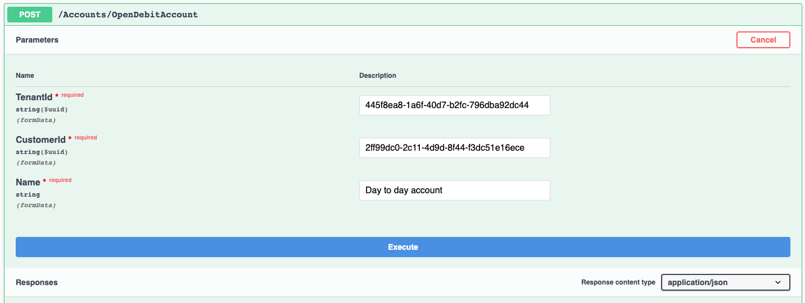
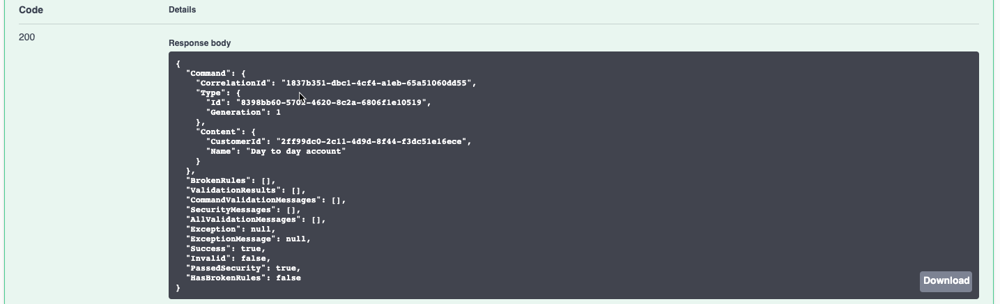
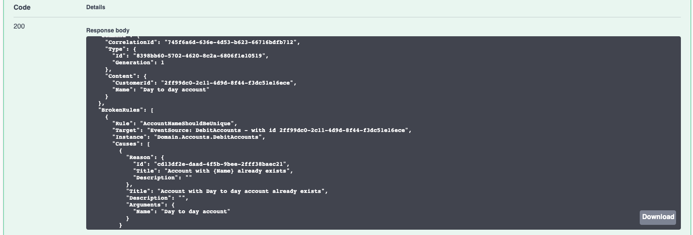
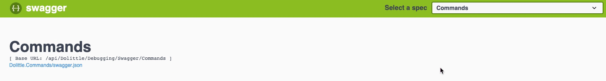
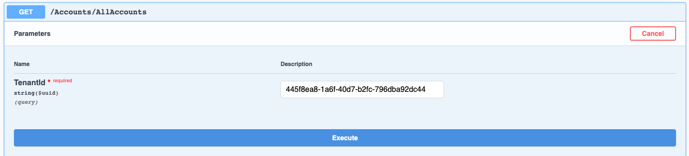
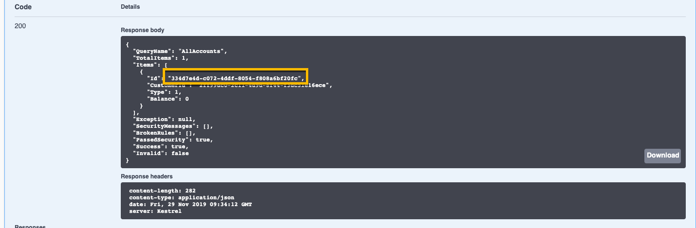
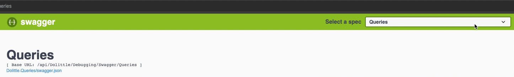
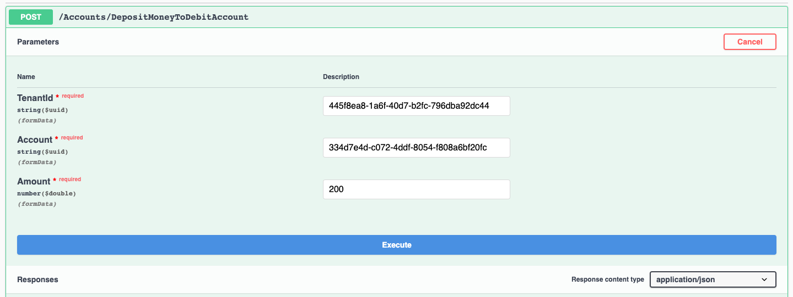

# Simple Bank Sample using Dolittle

This sample shows a simple bank sample and how you could build it using
Dolittle. Documentation for Dolittle can be found [here](https://dolittle.io).

## Prerequisites

This sample uses [.NET Core](https://dotnet.microsoft.com) and [NodeJS](https://nodejs.org/en/).
Specifically, the sample requires the 2.2 version of the .NET components. An upgrade in Dolittle
is underway to support the latest version of 3.1 for all.

To see if you have the correct runtime installed, you should do the following from a terminal:

```shell
$ dotnet --list-runtimes
````

It should show a list similar to the following:

```shell
Microsoft.AspNetCore.All 2.2.8 [/usr/local/share/dotnet/shared/Microsoft.AspNetCore.All]
Microsoft.AspNetCore.App 2.2.8 [/usr/local/share/dotnet/shared/Microsoft.AspNetCore.App]
Microsoft.AspNetCore.App 3.0.1 [/usr/local/share/dotnet/shared/Microsoft.AspNetCore.App]
Microsoft.AspNetCore.App 3.1.0 [/usr/local/share/dotnet/shared/Microsoft.AspNetCore.App]
Microsoft.NETCore.App 2.1.14 [/usr/local/share/dotnet/shared/Microsoft.NETCore.App]
Microsoft.NETCore.App 2.2.8 [/usr/local/share/dotnet/shared/Microsoft.NETCore.App]
Microsoft.NETCore.App 3.0.1 [/usr/local/share/dotnet/shared/Microsoft.NETCore.App]
Microsoft.NETCore.App 3.1.0 [/usr/local/share/dotnet/shared/Microsoft.NETCore.App]
```

If it does not have a Microsoft.AspNetCore.All/App or a NETCore.App og 2.2.x, you should go and
download and install it from [here](https://dotnet.microsoft.com/download/dotnet-core/2.2).
This will not replace your 3.x tooling, but install the missing runtime components.

## Application

The application consists of 2 microservices; Banking and Glance. They are configured as follows:

### Banking

Backend: http://localhost:5000

Frontend: http://localhost:8080

### Glance

Backend: http://localhost:5001

Frontend: http://localhost:8081

### MongoDB

For the read models, you will be needing a Mongo, the easiest way through Docker is to run
it as a daemon for your self:

```shell
$ docker run -d -p 27017:27017 mongo:4.0.13
```

This sample utilizes MongoDB as an event store as well.

### Starting the Microservices

Run them accordingly using multiple shell windows:

- `dotnet run` in the `Core` folder of both - this will run the backends
- `yarn` / `npm install` in the `Web` folder
- `yarn start` / `npm start` in the `Web` folder

The frontend projects are leveraging the [WebPack DevServer](https://webpack.js.org/configuration/dev-server/)
and utilizes its proxy capabilities for the necessary routes to the backend without having to
leave the same origin. The path `/api` and `/swagger` is proxied and will go to the backend.
So for it to do commands and queries, it can do so without changing origin.

This means that you can access the **swagger** interface even through the frontends.

### Trying things out

The solution is a simple banking experience and to get started with the bank, we want to
create a debit account and deposit some money to it. We're going to do this only using the
backend code.

Both microservices are configured with the [Dolittle Swagger debugging/development helper](https://dolittle.io/interaction/aspnetcore/aspnetcore-debugging-swagger/).

Navigate to `http://localhost:5000/swagger` (Or `http://localhost:8080/swagger` if you want to go through the frontend).

#### Opening a debit account

To open a debit account, open the command request called `Accounts/OpenDebitAccount` and add the
required information. The CustomerID should be a [Guid](https://guidgenerator.com) and represents
the unique identifier for the customer that is opening the debit account.
You could use this Guid: `334d7e4d-c072-4ddf-8054-f808a6bf20fc`.



After clicking `Execute` you should see a response as below, this is what we call the **CommandResult**.
It contains information about the result after performing a **CommandRequest**. Typically, if there are
any authorization, validation or business rules broken - they'll show up in this. Also, if there for
some reason is an exception; typically due to infrastructural issues - this will also be here.



With Dolittle being focused around [CQRS](https://www.martinfowler.com/bliki/CQRS.html) and
[Event Sourcing](https://martinfowler.com/eaaDev/EventSourcing.html), there is no unique key that
come from the underlying data store. To overcome this problem, we use [Guid](https://en.wikipedia.org/wiki/Universally_unique_identifier)
as primary keys in everything. These can be generated already in the frontend if we want to.
In our sample, this is done in the command handler.

The operation of opening the debit account is a command, and is represented by a type found
[here](./Source/Banking/Domain/Accounts/OpenDebitAccount.cs). In order for it to be handled,
it relies on it being valid - which is where the input validator for the command fits in, which
is found [here](./Source/Banking/Domain/Accounts/OpenDebitAccountInputValidation.cs).
Once its valid, we go on to the actual handling of the command, which is implemented [here](./Source/Banking/Domain/Accounts/DebitAccountsCommandHandlers.cs).

The command handler will then coordinate the effort of what it means by opening a debit account.
It relies on what is called an [Aggregate Root](https://www.martinfowler.com/bliki/DDD_Aggregate.html)
to do this. Our particular aggregate root for this scenario is called [DebitAccounts](./Source/Bankning/Domain/Accounts/DebitAccounts.cs).
It governs all the accounts for a customer and all the rules associated with organizing accounts.
One of the rules for instance is that you are not allowed to have 2 accounts with the same name.
Running the same command with the same properties on it, should therefor yield the following result:



The event that gets produced from this is called [DebitAccountOpened](./Source/Banking/Events/Accounts/DebitAccountOpened.cs).
From this event we typically keep an optimized read model for each feature that is interested in
the event that is produced. Each feature has an opportunity to optimize this read model in any way they
want and use any storage technology - or even multiple storage technologies for the same feature for
different purposes. This is possible due to the fact that the source of truth will be in the event store.
In fact, we can consider the read model a perfect cache, a current state.

The event gets processed by an event processor, and the one dealing with the `DebitAccountOpened` event
sits [here](./Source/Banking/Read/Accounts/AccountEventProcessors.cs). What it does is basically create an instance
of a read model with the unique identifier; `EventSourceId` that comes as the metadata associated with
the event. Then it inserts this into the database; in our case a MongoDb instance.

#### Depositing money to our debit account

In order for us to deposit money to the debit account, we need to go find the identifier of the
account created. Navigate to the **Queries** spec in the swagger UI:



Then execute the `Accounts/AllAccounts` query.



The query itself is implemented [here](./Source/Banking/Read/Accounts/AllAccounts.cs).
From the response, we're interested in the **Guid** of the debit account.
Copy it from the response:



With the **Guid** of the debit account, we can now deposit money to it.
Navigate back to the **Commands** spec in the swagger UI:



Open up the `Accounts/DepositMoneyToDebitAccount` command and insert the **Guid**
into the **Account** property. Then put an amount in and execute it.
The command can be found [here](./Source/Banking/Domain/Accounts/DepositMoneyToDebitAccount.cs),
its input validation is [here](./Source/Banking/Domain/Accounts/DepositMoneyToDebitAccountInputValidation.cs)
and handled by [this](./Source/Banking/Domain/Accounts/DebitAccountCommandHandlers.cs) command handler.
Notice that it works with a different aggregate root; [DebitAccount](./Source/Banking/Domain/Accounts/DebitAccount.cs);
singular. This aggregate will be responsible for all things important to an account, and governs
all the rules for a single debit account.



Going back to the **Queries** spec and running the `AllAccounts` query should now
yield a result with the amount you deposited to the account.

### Event Horizon and events between microservices

In **Glance** there is a second event project called `Events.Banking`.
This holds the events **Glance** is interested in from **Banking**.
Notice that the event is tagged with an attribute of `Artifact` with
the identifier of the event found in `artifacts.json` in **Banking**
inside the `.dolittle` folder of the `Core` project.
This same identifier is also configured in the `event-horizons.json`
file of **Glance** in the `.dolittle` folder of the `Core` project there.
There is an `EventProcessor` in **Glance** that consumes this event and
prints out a message.
